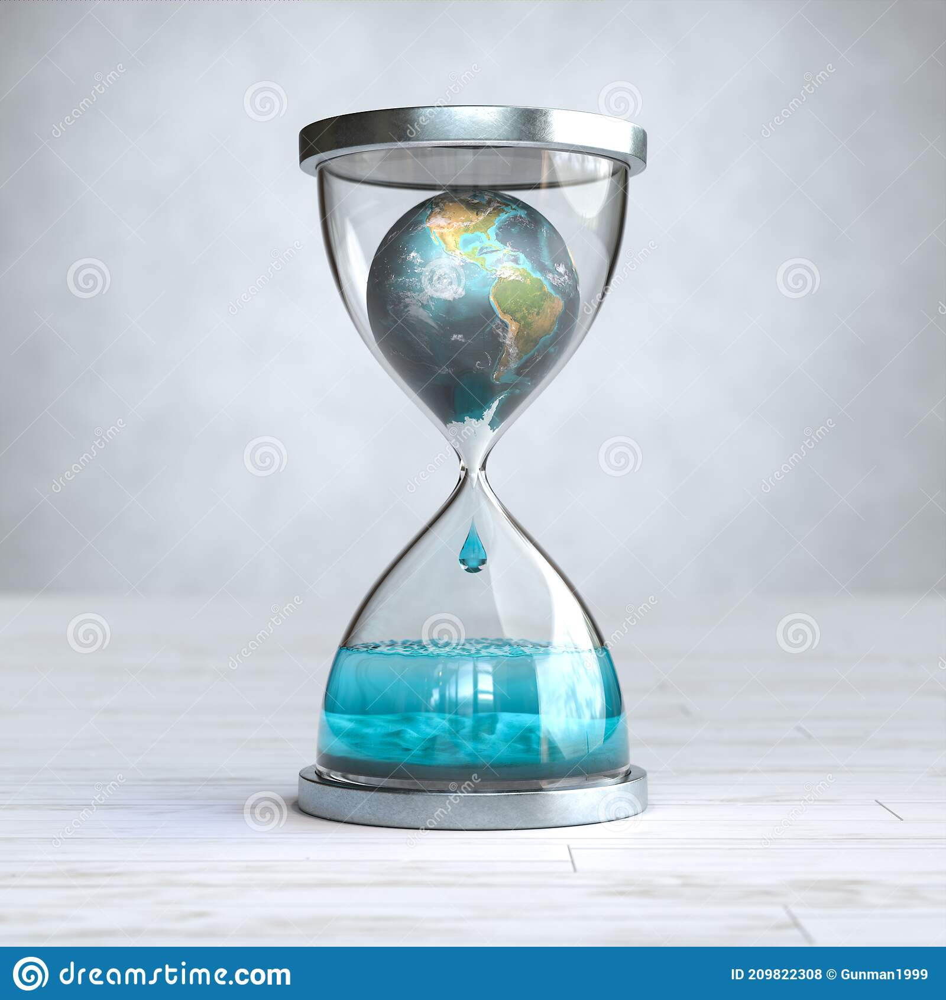

## lemniskater.github.io
##
# This is a placeholder image. I will be creating my own.

Artist Statement: I chose to make this artifact in this way to provide a visual representation of how time and climate change are related in a more literal sense. Every second that passes, our earth slowly dies, no matter our actions. A doomsday clocks presents a view of how close humanity is to destroying itself through global catastrophe, a what-if clock. This hourglass represents our earth now, this is what is currently happening, our earth is dying and we either accelerate or keep that process at its normal speed. We can never stop this hourglass from flowing but we can prevent unnecessary leaking, its up to us to determine whether or not this hourglass keeps itself on track or ends much faster than we anticipate.

## (I may add ways you can contribute to climate change awareness, websites, articles, that kind of stuff)
